# 设计概念

## 诉求与痛点

目前在维护的多个项目都需要配置导航、路由和面包屑，它们分别存放在不同的文件中，部分内容是动态代码等等情况。在新增页面时和修改都带来了很多麻烦与不便。

## 定义与作用

刚开始想把Vue-Router都纳入管理，后来想想何必这么麻烦，各自独立管理不也是一种合作吗？所以将组件定义为一个处理数据的工具集。基于这个思路所有的函数都是输入的树状数据进行处理。那么这份输入的数据将包含所有的内容，其中作为最基础的就是标记、名称、子节点那些字段。

其实这个工具集合处理的更多是树状结构的内容填入、扁平化处理，还有再次组合这样操作。

比如，`getNavi()`函数，传入配置树数据后，先是使用`stuff()`函数遍历填充默认字段，然后`flat()`扁平化获得层级和父级节点信息，再使用`combo()`函数将它们组合为一课新树返回给我使用。

执行顺序：

1. `stuff()` 填充默认字段信息给所有节点
2. `flat()` 扁平化，将层级和父级节点信息填充至每个节点
3. `combo()` 组合，根据父级节点信息将所有信息再组合起来

所以这个工具只是**处理树状数据的函数集**而已。

## 边界

权限？路由限制？导航显示控制？这些判断逻辑只是一个函数，判断的基准就一堆堆的数据。正好本工具并没有从真正意义上处理过节点的内容（只处理结构）。

要做权限和各种控制，建议按处理函数（不变）和数据（多变）进行划分，将数据记录在节点中，处理函数则在每份数据需要使用时再调用。

结论：**工具只处理树状数据，数据该什么时候有，该填什么数据一概不管。**
