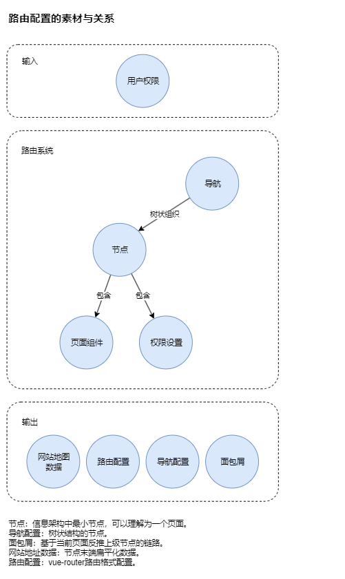

# 设计概念

## 功能概述

配一次导航生成路由、面包屑、网站地图数据

核心功能：

- 输入节点集合
- 根据路由结构输出路由配置
- 根据导航结构输出导航配置
- 根据节点名称输出面包屑

## 要素与关系



<路由配置的素材与关系>

### 输入的节点

```js
const nodes = [{
 "name": "posts/draf",  //节点名称，必要
 "path": "/posts/draf", //节点路径规则，必要，对应vue-router或其他路由库
 "meta": {              //节点附加信息，非必要。
  "title": "草稿箱",    //节点显示名称， 非必要，可用于显示浏览器便签使用 
  "nav": {             //节点附加信息的其他内容
   "type": "menu",
   "defaultPath": "/posts/draf"
  },
 },
 "component": "../pages/posts/draf.vue" //节点渲染组件
}]
```

### 路由结构

路由的结构更多配合于路由库特性本身，如vue-router的使用上UI结构上存在嵌套才需要考虑在路由上进行子级划分。

所以在使用上期望所有配置内容写在节点上，组织结构将以下面的方式进行输入。

```js
//使用详情，可参考 Function.spect.js
import naviMaker from "@packy-tang/navi-maker"
naviMaker.init({nodes:[...]})

const routes = naviMaker.getRoute([
  [
    "home",
    [
      "dashboard",
      "posts/draf",
      "posts/publish",
      "posts/trash",
    ]
  ],
  "login"
])

console.log(routes)
/**
 * 输出结果：详情见 test/route.json
 * 
[
  {
    "name": "home",
    "path": "/",
    "meta": {
      "title": "首页"
    },
    "component": "../pages/commons/Layout.vue",
    "children": [
      {
        "name": "dashboard",
        "path": "dashboard",
        "meta": {
          "title": "仪表盘"
        },
        "component": "../pages/Dashboard.vue",
        "children": []
      },
      {
        "name": "posts/draf",
        "path": "/posts/draf",
        "meta": {
          "title": "草稿箱",
          "nav": {
            "open": "+posts",
            "active": "posts/draf"
          }
        },
        "component": "../pages/Dashboard.vue",
        "children": []
      },
      {
        "name": "posts/publish",
        "path": "/posts/publish",
        "meta": {
          "title": "发布库",
          "nav": {
            "open": "+posts",
            "active": "posts/publish"
          }
        },
        "component": "../pages/Dashboard.vue",
        "children": []
      },
      {
        "name": "posts/trash",
        "path": "/posts/trash",
        "meta": {
          "title": "垃圾桶",
          "nav": {
            "open": "+posts",
            "active": "posts/trash"
          }
        },
        "component": "../pages/Dashboard.vue",
        "children": []
      }
    ]
  },
  {
    "name": "login",
    "path": "/auth/login",
    "meta": {
      "title": "登录"
    },
    "component": "../pages/Login.vue",
    "children": []
  }
]
*/
```

### 导航结构

导航结构与页面UI显示的内容结构直接相关，这可和路由结构没有多大的关系，属于独立体系。不过处理的逻辑与路由是一致的，这俩的使用大差不差。

```js
//使用详情，可参考 Function.spect.js
import naviMaker from "@packy-tang/navi-maker"
naviMaker.init({nodes:[...]})

const navi = naviMaker.getNavi([
  "dashboard",
  [
    "+posts",
    [
      "posts/draf",
      "posts/publish",
      ["+other",["posts/trash"]]
    ]
  ]
])

console.log(navi)
/**
 * 输出结果：详情见 test/navi.json
 * 
[
  {
    "name": "dashboard",
    "meta": {
      "title": "仪表盘"
    },
    "component": "../pages/Dashboard.vue",
    "level": 0,
    "type": 0,
    "title": "仪表盘",
    "children": []
  },
  {
    "name": "+posts",
    "meta": {
      "title": "文章库"
    },
    "level": 0,
    "type": 1,
    "title": "文章库",
    "children": [
      {
        "name": "posts/draf",
        "meta": {
          "title": "草稿箱",
          "nav": {
            "open": "+posts",
            "active": "posts/draf"
          }
        },
        "component": "../pages/Dashboard.vue",
        "level": 1,
        "type": 0,
        "title": "草稿箱",
        "children": []
      },
      {
        "name": "posts/publish",
        "meta": {
          "title": "发布库",
          "nav": {
            "open": "+posts",
            "active": "posts/publish"
          }
        },
        "component": "../pages/Dashboard.vue",
        "level": 1,
        "type": 0,
        "title": "发布库",
        "children": []
      },
      {
        "name": "+other",
        "meta": {
          "title": "其他"
        },
        "level": 1,
        "type": 1,
        "title": "其他",
        "children": [
          {
            "name": "posts/trash",
            "meta": {
              "title": "垃圾桶",
              "nav": {
                "open": "+posts",
                "active": "posts/trash"
              }
            },
            "component": "../pages/Dashboard.vue",
            "level": 2,
            "type": 0,
            "title": "垃圾桶",
            "children": []
          }
        ]
      }
    ]
  }
]
*/
```

### 面包屑

面包屑功能为获取某节点至顶节点的路径。

```js
//使用详情，可参考 Function.spect.js
import naviMaker from "@packy-tang/navi-maker"

naviMaker.init({
  navi:[...],
  nodes:[...]
})
const crumb = naviMaker.getCrumb("posts/trash")

console.log(crumb)
/**
 * 输出结果：
[
  {
    name: '+posts',
    meta: { title: '文章库' },
    title: '文章库',
    path: undefined,
    children: [ [Object], [Object], [Object] ]
  },
  {
    name: '+other',
    meta: { title: '其他' },
    title: '其他',
    path: undefined,
    children: [ [Object] ]
  },
  {
    name: 'posts/trash',
    path: undefined,
    meta: { title: '垃圾桶', nav: [Object] },
    component: '../pages/Dashboard.vue',
    title: '垃圾桶'
  }
]
*/
```


